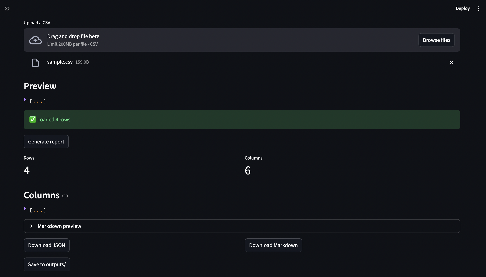

# CSV Profiler

Generate a profiling report for a CSV file.

## Features

- The CLI writes:
    - `outputs/report.json`
    - `outputs/report.md`
- The Streamlit app can:
    - preview the report
    - download JSON + Markdown

## Setup

```bash
uv sync
```

## Run

If you have a `src/` folder:
  - On Mac/Linux: `export PYTHONPATH=src`
  - On Windows:   `$env:PYTHONPATH="src"`

Then run the app:

```bash
uv run streamlit run app.py
```


Or run the CLI:

```bash
uv run python -m csv_profiler.cli profile data/sample.csv --out-dir outputs
```
